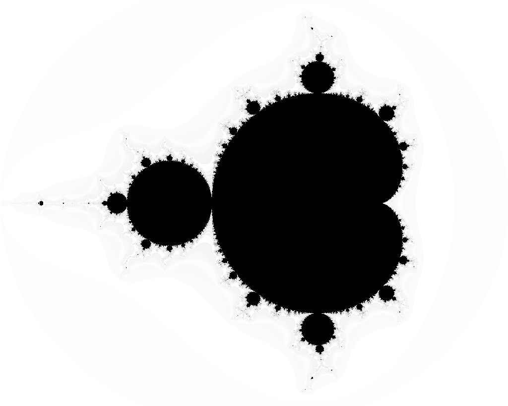

# m
mandlebrot image generator in go

# png
```
$ go install github.com/cyberworm-uk/m/cmd/png@latest
$ ~/go/bin/png -h
Usage of /home/user/go/bin/png:
  -imag-end float
        end of imaginary range (default 1.2)
  -imag-start float
        start of the imaginary range (default -1.2)
  -limit int
        iteration limit for bounding check (precision) (default 200)
  -real-end float
        end of the real range (default 1)
  -real-start float
        start of the real range (default -2)
  -width int
        image output width (default 1024)
```


# gif
```
$ go install github.com/cyberworm-uk/m/cmd/gif@latest
Usage of /home/user/go/bin/gif:
  -anim string
        type of animation: "resolve" or "zoom" (default "resolve")
  -frames int
        number of frames of animation (default 100)
  -imag-end float
        end of imaginary range (default 1.2)
  -imag-start float
        start of the imaginary range (default -1.2)
  -limit int
        iteration limit for bounding check (precision) (default 200)
  -real-end float
        end of the real range (default 1)
  -real-start float
        start of the real range (default -2)
  -width int
        image output width (default 1024)
```

